# CS Hardware - Day 3

## Time

---

# Goal For Today

By the end of today you will:

- Understand what capacitors do
- Learn how capacitors interact with time
- Connect timing circuits to real computer hardware

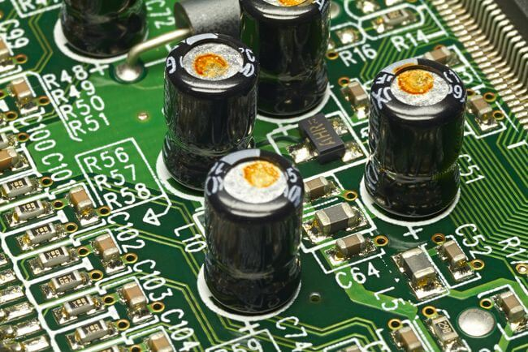

---

# Review From Day 2

Yesterday we learned:

- Transistors act like switches
- Small signals can control larger signals
- Logic gates are built from transistors
- Computers use binary ON/OFF states
- Billions of transistors power modern CPUs

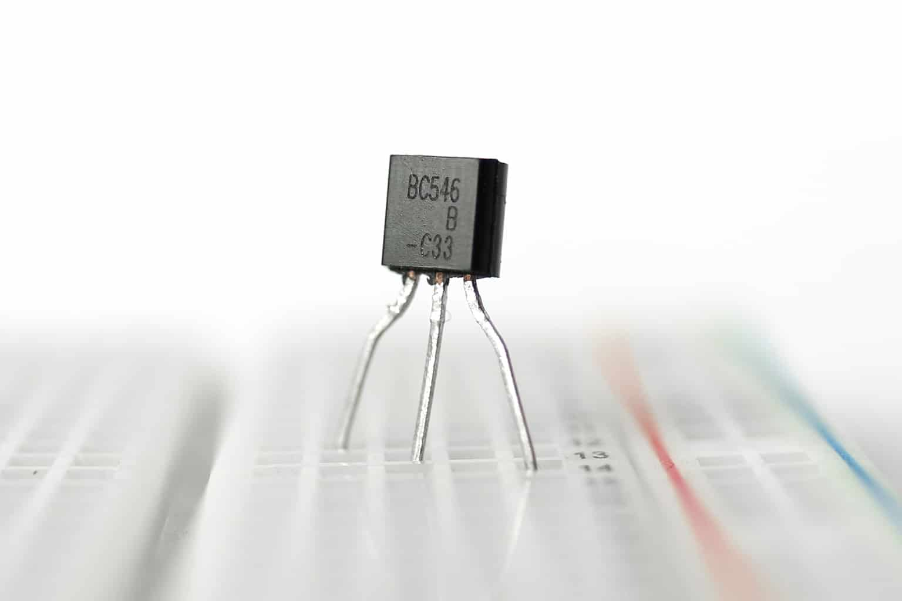

---

# Review From Day 1

We also learned:

- Voltage pushes current
- Resistance limits current
- LEDs have polarity
- Ohm's Law: **V = I × R**
- Multimeters help us debug circuits

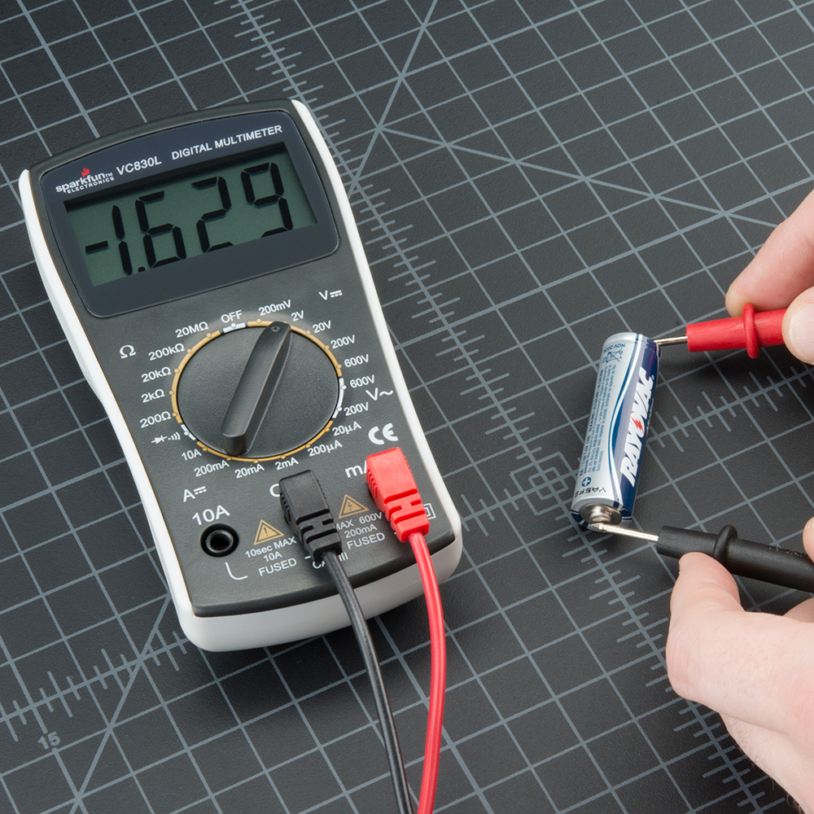

---

# Today

Today we add a new idea: **TIME**

- Some electronic components respond instantly.
- Others change slowly over time.

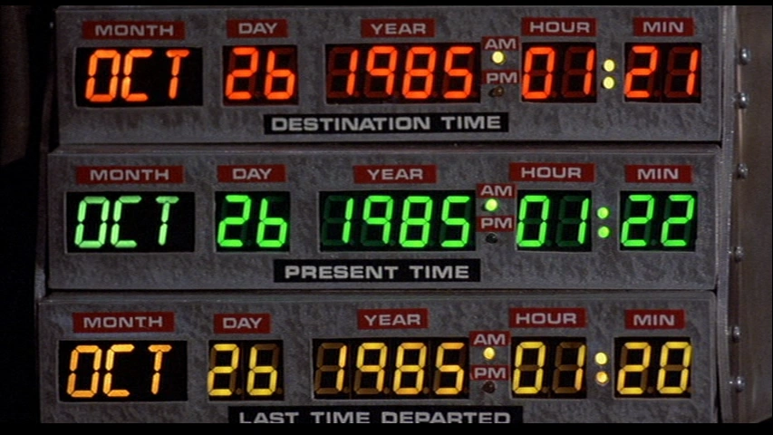

---

# Today's Workflow

1. History lesson
2. Learn what a capacitor is
3. Build a charge/discharge circuit
4. Build a smoothing circuit
5. Build an oscillator circuit

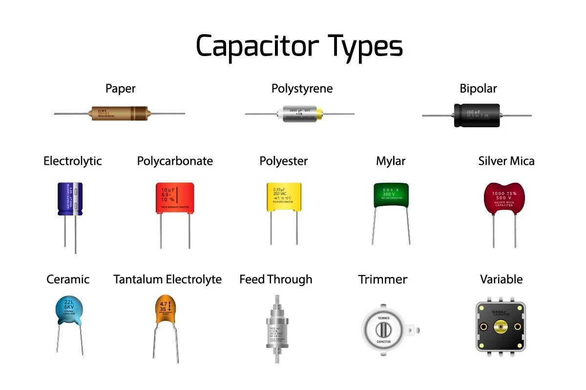

---

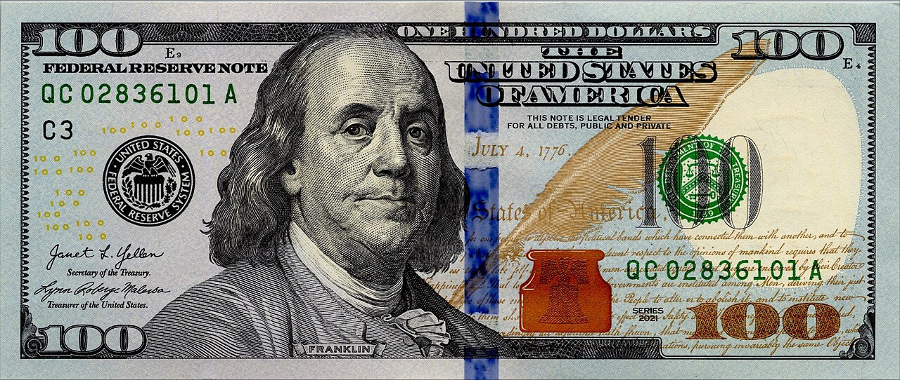

<!-- INSTRUCTOR NOTES:

Ben Franklin was a electricity enthusiast and experimenter. Electricity was a curiosity at the time. People didn't yet understand how it worked, though they could observe natural phenomeon like lightning and static electric shocks.

-->

---

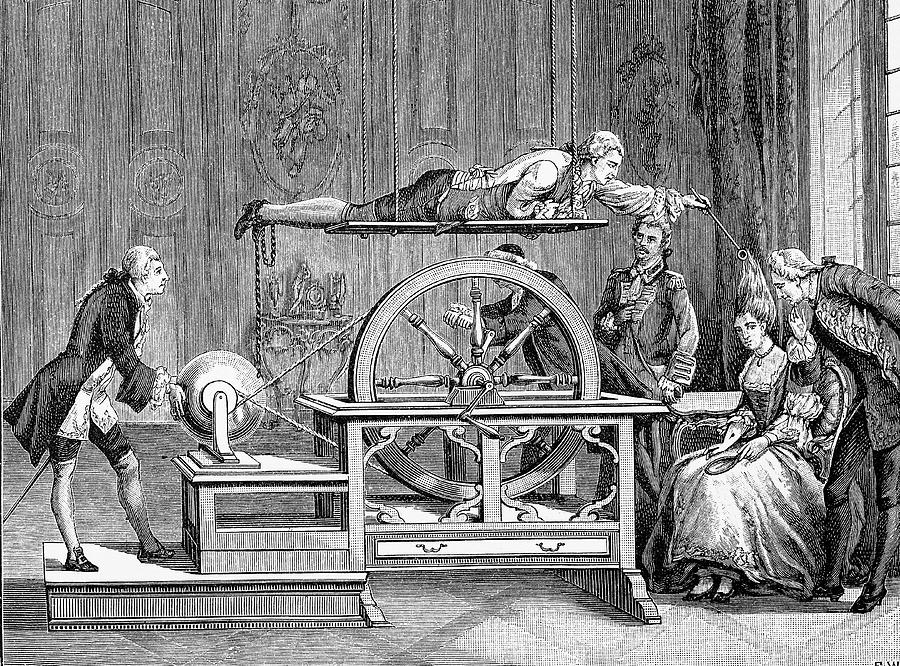

<!-- INSTRUCTOR NOTES:

Electrician comes from magician. People went around doing demonstrations with electricity like magic tricks.

-->
---

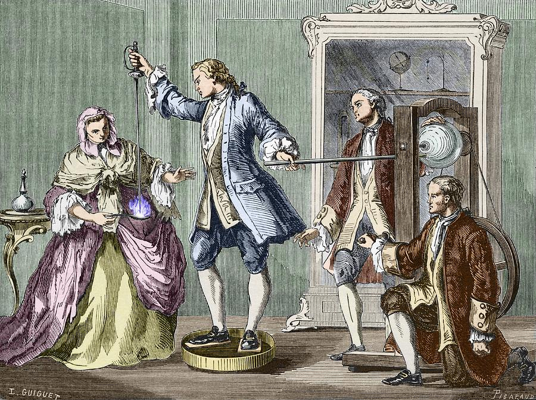

<!-- INSTRUCTOR NOTES:

people studied electricity to try and understand it and shocked themselves often

One of Franklin's favorite experiments was the "circle shock." In the circle shock, a group of people hold hands and one person at the end of the human chain holds the outside of the Leyden jar, while the person on the other end of the human chain touches the inner conductor. If there is enough charge in the jar, every person in the circle will feel a shock.

-->

---

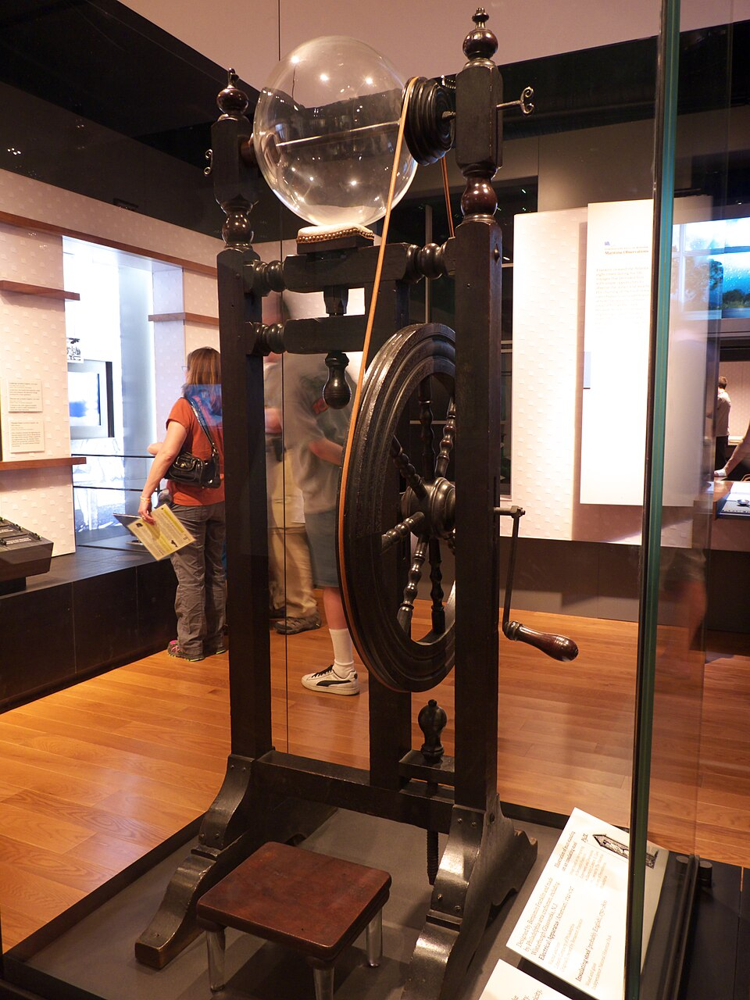

<!-- INSTRUCTOR NOTES:

Franklin developed this machine to generate static electricity.

-->

---

<!-- INSTRUCTOR NOTES:

Franklin did experiements with electricity to help with health (eg depression, paralysis, pain, etc.)

It didn't actually cure anything, but we still have electric therapies for depressiojn

-->

---

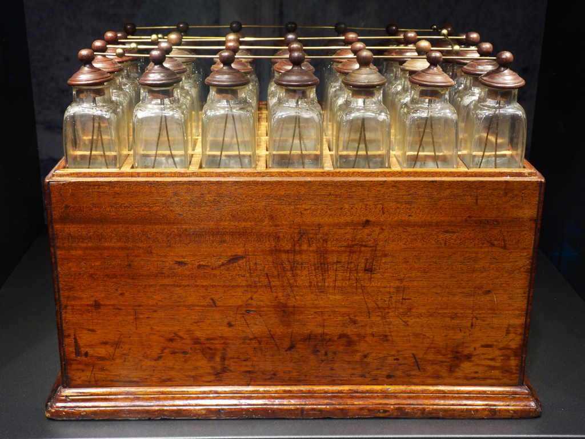

<!-- INSTRUCTOR NOTES:

-->

---

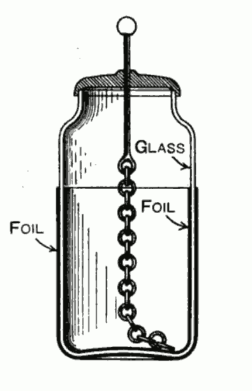

<!-- INSTRUCTOR NOTES:

The original Leyden jar held water as the inner conductor. Early electrical experimenters thought that the charge was held in the water. However, Benjamin Franklin was the first person to figure out that the charge in the Leyden jar is located where the insulator meets the electrode (in this case, the water). Thus, water is not required and can be replaced by attaching an electrode, such as aluminum foil, to the inside of the jar. Franklin also connected several Leyden jars together and created what he called a battery. This is not a battery like we know today, but it was a way to store lots of charge for Franklin's electrical experiments.

# is this true?
Franklin intuited (positive and negative charge) as a build up (and lack of) electrons. 

He actually mistaked that electricity flowed positive to negative (which is wrong and took 100+ years to figure out). So we have "conventional current" but it actually flows negative to positive

-->

---

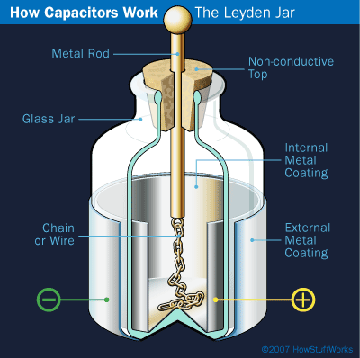

<!-- INSTRUCTOR NOTES:

-->

---

# What Is A Capacitor?

A capacitor stores electrical energy in an electric field.

| Component | Energy Storage | Charge / Discharge |
| --------- | -------------- | ------------------ |
| Battery   | Chemical       | Slow               |
| Capacitor | Electric Field | Fast               |

<!-- INSTRUCTOR NOTES:

Think of it like:

- a tiny rechargeable bucket
- a spring for electrons
- short-term memory for a circuit

-->

[Video: Capacitors Explained](https://www.youtube.com/watch?v=X4EUwTwZ110)

---

# Why do we need to store a charge?

- Camera flashes
- Audio systems
- Phone chargers
- Power supplies
- Motherboards
- WiFi radios
- DRAM memory
- Timing circuits

---

# Capacitor Basics

Capacitors have:

- Two conductive plates
- An insulating material between them
- As charge builds voltage across the capacitor increases
- *Some* capacitors have polarity

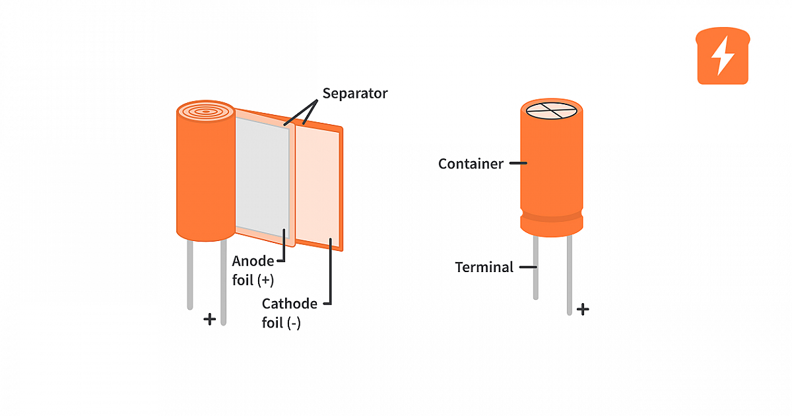

---

# Units

Capacitance is measured in **Farads (F)**

- microfarad (μF,	`0.000001F`)
- nanofarad (nF, `0.000000001F`)
- picofarad (pF, `0.000000000001F`)

<!-- Named after Faraday -->

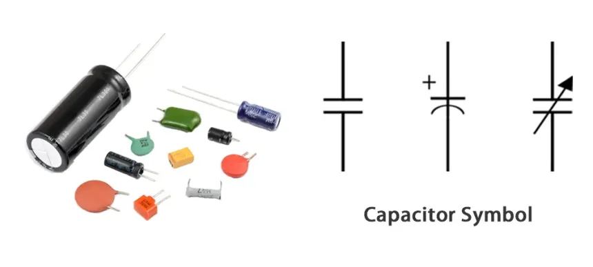

---

# RC Circuit

The timing behavior is controlled by `τ = R × C`

Where:

- **R** = resistance
- **C** = capacitance
- *τ* (tau) = time constant

<!-- INSTRUCTOR NOTES

- A resistor + capacitor together form an: **RC Circuit**
- The resistor controls how fast the capacitor charges/discharges. 

Larger resistor = slower
Larger capacitor = slower

-->

---

# Charging Curve

When charging:

- voltage rises gradually
- current decreases gradually

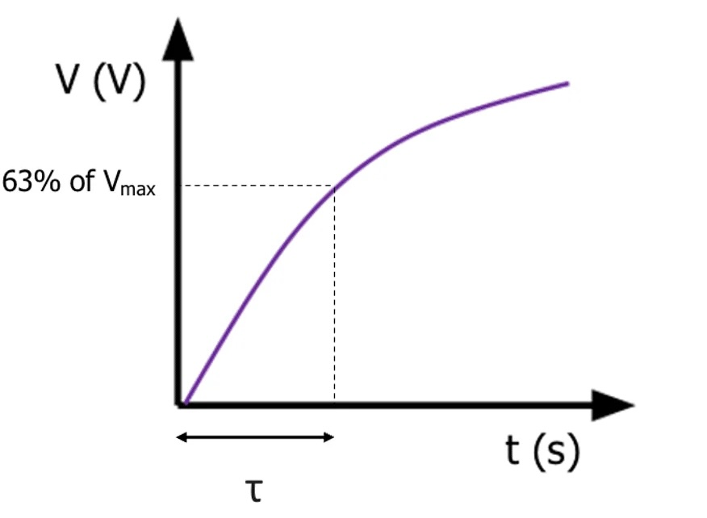

<!-- INSTRUCTOR NOTES:

Resistors respond immediately.

Capacitors change over time.

At first capacitor charges quickly
Later charging slows down
Eventually capacitor becomes mostly full

-->

---

# Discharging Curve

When discharging:

- stored energy leaves the capacitor
- voltage falls gradually

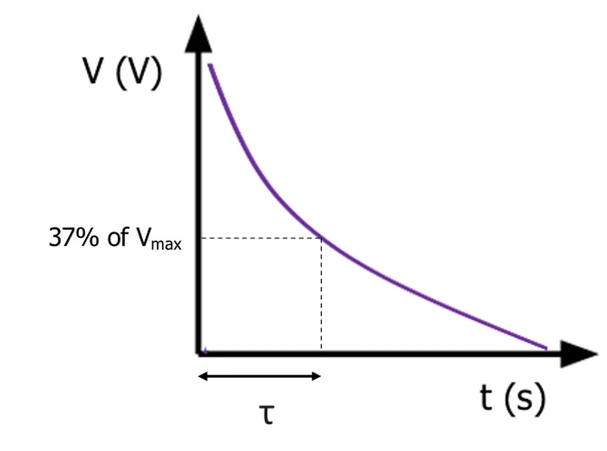

---

# Intuition

| Component | Effect |
| --- | --- |
| Bigger resistor | Slower charging |
| Bigger capacitor | More stored charge |
| Smaller resistor | Faster charging |
| Smaller capacitor | Faster fading |

[Visualization](https://mechsimulator.com/tools/rc-circuit/)

---

# Demo: Measuring Capacitors

Use the multimeter to measure capacitance (if supported)

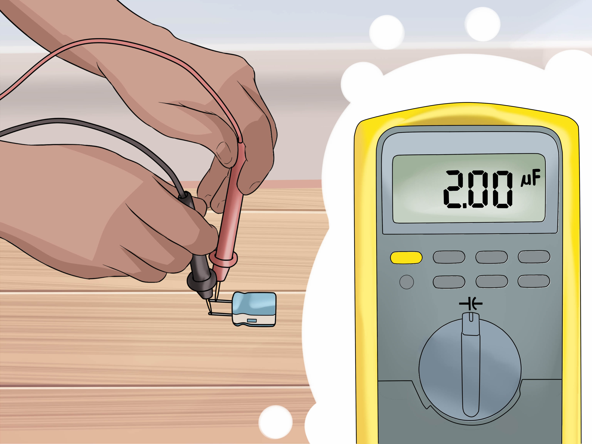

---

# Demo: RC Timer Circuits

Let's build some resistor capacitor LED circuits and observe their behavior.

<!--

Be careful not to short the battery or the LED

-->

---

# Demo: Capacitor Charge/Discharge Circuit

<!--  -->

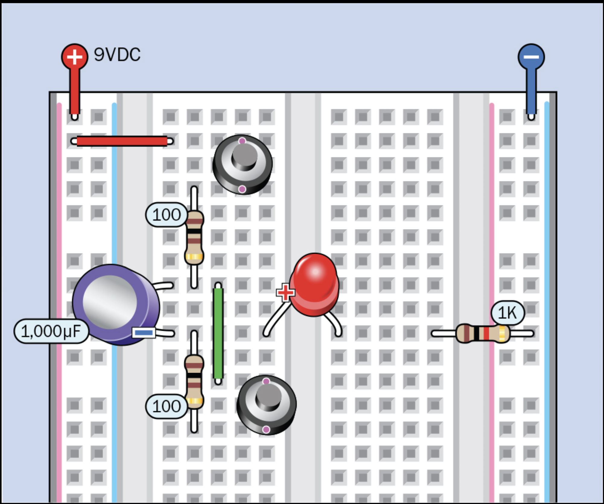

---

# Demo: Capacitor Charge/Discharge Circuit

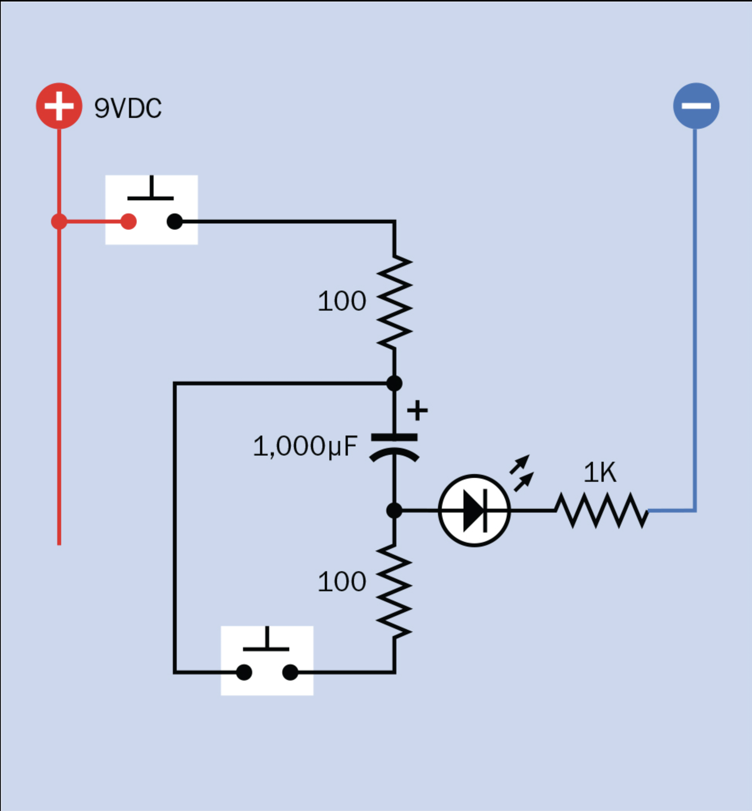

---

# Demo: Capacitor Charge/Discharge Circuit

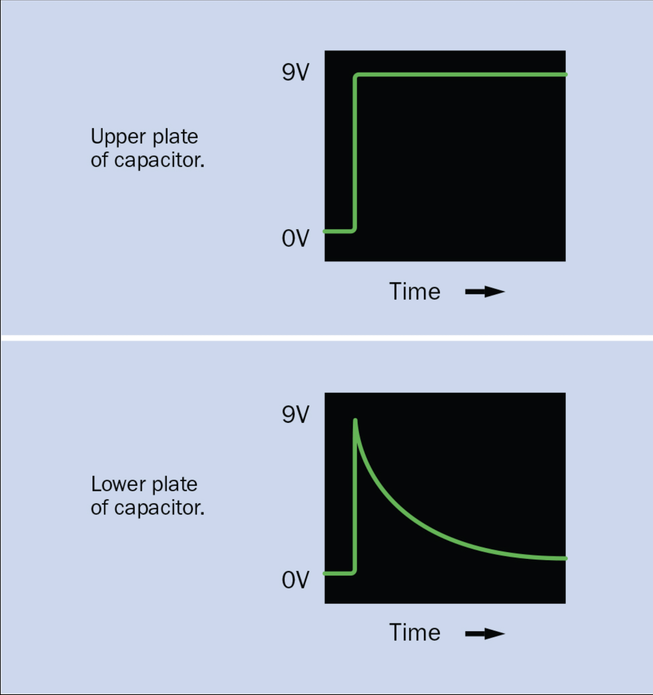

<!-- INSTRUCTOR NOTES:

This phenomena can be helpful with amplifiers and components that require a brief spike in voltage as a trigger

-->

---

# Lab Breakout #1

## Capacitor Charge/Discharge Circuit

---

# Demo: Smoothing Capacitor

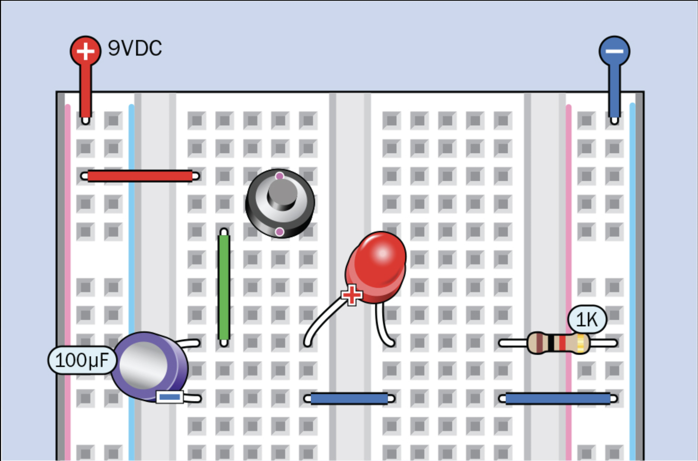

---

# Demo: Smoothing Capacitor

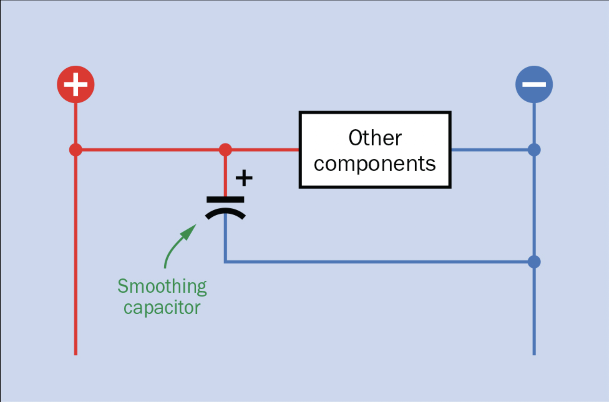

---

# Demo: Smoothing Capacitor

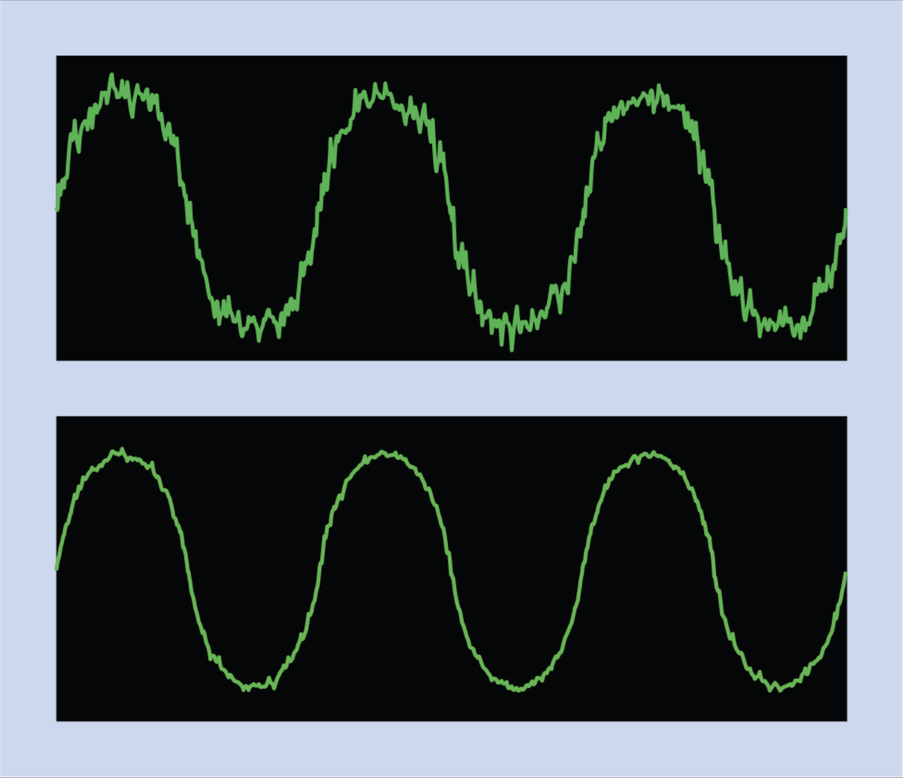

<!-- INSTRUCTOR NOTES:

Reduce power supply ripple and dirty audio signals

-->

---

# Lab Breakout #2

## Smoothing Circuit

---

# Capacitors + Transistors

**Yesterday**: *transistors* controlled switching
**Today**: *capacitors* control timing

Together they create:

- oscillators
- clocks
- timers
- memory systems

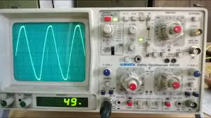

---

# Oscillators

An oscillator repeatedly switches between ON and OFF.

Examples:

- blinking LEDs
- clock circuits
- alarm sounds
- CPU clocks
- radio signals

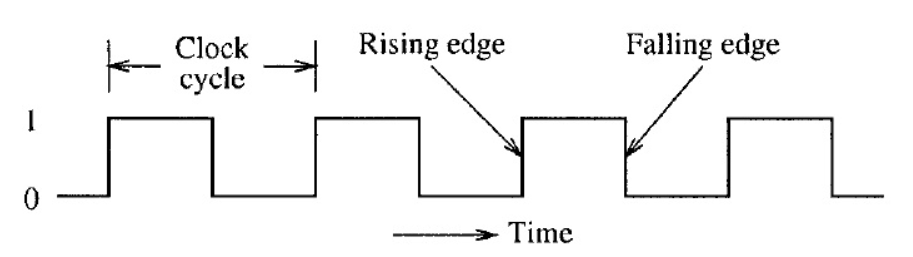

---

# Why Oscillators Matter

Computers need clocks. A clock signal tells circuits:

- when to update
- when to compute
- when to store data

Without timing, CPUs cannot coordinate operations.

<!-- INSTRUCTOR NOTES:

measured in Hz

1 Hertz = 1 cycle per second

Modern processors operate at billions of cycles per second (3 GHz = 3 billion oscillations per second)

it's also how sound/music works!

-->

---

# Demo: Astable Multivibrator

A classic transistor oscillator. It continuously flips between two states.

The capacitors repeatedly:

- charge
- trigger transistors
- discharge
- switch sides

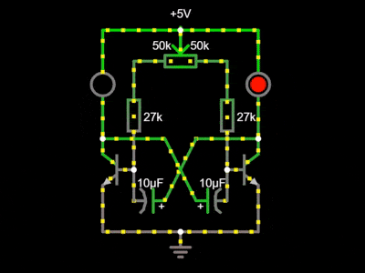

<!--

Observe:

- alternating LEDs
- timing changes
- capacitor charge/discharge behavior

Questions:

- What changes blink speed?
- What happens with larger capacitors?
- What happens with larger resistors?

-->

---

# Debugging Timing Circuits

If your circuit does NOT work:

- check capacitor polarity
- verify resistor values
- check transistor orientation
- inspect loose wires
- verify power rails
- test LEDs individually

Timing circuits can fail in subtle ways.

---

# Lab Breakout #3

## Astable Multivibrator

**Goal**: Build a two-transistor blinking LED oscillator.

<!-- 

Try:

- changing capacitor values
- changing resistor values
- mismatched timing components
- measuring blink frequency

-->

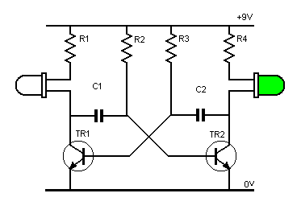

---

# Key Takeaways

<!--

- Capacitors store electrical energy
- Capacitors introduce TIME into circuits
- RC circuits create delays and fades
- Timing depends on resistance and capacitance
- Oscillators repeatedly switch states
- Computers depend heavily on timing circuits
- Memory systems often use capacitors

-->
